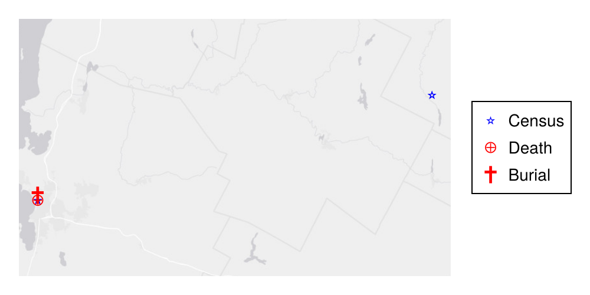

> *Page automatically generated.*

# Ebenezer White


## Biographical summary


*born* 1779-07-09 : *died* 1852-10-31

**Mother**: [Ruth Wilson](./Wilson-line/Ruth_Wilson.html)

**Father**: [Benjamin White](./Benjamin_White.html)

**Children with [Candace Smith](./Candace-Smith-line/Candace_Smith.html)**:


- [Horatio Nelson White](./Horatio_Nelson_White.html)

- [Adaline White](./Adaline_White.html)

- [Eliza Ann White](./Eliza_Ann_White.html)

- [Hiram Smith White](./Hiram_Smith_White.html)

- [Artemas White](./Artemas_White.html)


Documented ancestors:

```{mermaid}
graph RL
%% RL ancestor diagram
Ebenezer_White(<a href=''>Ebenezer White</a>) -->  Benjamin_White(<a href='./Benjamin_White.html'>Benjamin White</a>)
class Benjamin_White father
Ebenezer_White(<a href=''>Ebenezer White</a>)  --> Ruth_Wilson(<a href='./Wilson-line/Ruth_Wilson.html'>Ruth Wilson</a>)
class Ruth_Wilson mother
classDef mother fill:#ffd1dc
classDef father fill:#daf0f7  
classDef marriage fill:#ffffff

```


Documented descendants:

```{mermaid}
graph LR
%% LR descendant diagram
class Ebenezer_White_and_Candace_Smith marriage
Ebenezer_White(<a href=''>Ebenezer White</a>) --> Ebenezer_White_and_Candace_Smith{{ }}
Candace_Smith(<a href='./Candace-Smith-line/Candace_Smith.html'>Candace Smith</a>) --> Ebenezer_White_and_Candace_Smith{{ }}
class Ebenezer_White father
class Candace_Smith mother
Ebenezer_White_and_Candace_Smith{{ }} --> Horatio_Nelson_White(<a href='./Horatio_Nelson_White.html'>Horatio Nelson White</a>)
class Horatio_Nelson_White_and_Syrena_Adams marriage
Horatio_Nelson_White(<a href=''>Horatio Nelson White</a>) --> Horatio_Nelson_White_and_Syrena_Adams{{ }}
Syrena_Adams(<a href='./Syrena_Adams.html'>Syrena Adams</a>) --> Horatio_Nelson_White_and_Syrena_Adams{{ }}
class Horatio_Nelson_White father
class Syrena_Adams mother
Horatio_Nelson_White_and_Syrena_Adams{{ }} --> William_E._White(<a href='./William_E._White.html'>William E. White</a>)
class William_E._White_and_Ellen_Grandey marriage
William_E._White(<a href=''>William E. White</a>) --> William_E._White_and_Ellen_Grandey{{ }}
Ellen_Grandey(<a href='./../Grandey-line/Ellen_Grandey.html'>Ellen Grandey</a>) --> William_E._White_and_Ellen_Grandey{{ }}
class William_E._White father
class Ellen_Grandey mother
William_E._White_and_Ellen_Grandey{{ }} --> Anna_Serena_White(<a href='./Anna_Serena_White.html'>Anna Serena White</a>)
class Anna_Serena_White_and_James_Albee_Merrill marriage
Anna_Serena_White(<a href=''>Anna Serena White</a>) --> Anna_Serena_White_and_James_Albee_Merrill{{ }}
James_Albee_Merrill(<a href='./../James_Albee_Merrill.html'>James Albee Merrill</a>) --> Anna_Serena_White_and_James_Albee_Merrill{{ }}
class James_Albee_Merrill father
class Anna_Serena_White mother
Anna_Serena_White_and_James_Albee_Merrill{{ }} --> Marguerite_Merrill(<a href='./../Marguerite_Merrill.html'>Marguerite Merrill</a>)
class Marguerite_Merrill_and_John_Dubois_Henderson marriage
Marguerite_Merrill(<a href=''>Marguerite Merrill</a>) --> Marguerite_Merrill_and_John_Dubois_Henderson{{ }}
John_Dubois_Henderson(<a href='./../Henderson-line/John_Dubois_Henderson.html'>John Dubois Henderson</a>) --> Marguerite_Merrill_and_John_Dubois_Henderson{{ }}
class John_Dubois_Henderson father
class Marguerite_Merrill mother
Marguerite_Merrill_and_John_Dubois_Henderson{{ }} --> John_Merrill_Henderson(<a href='./../Henderson-line/John_Merrill_Henderson.html'>John Merrill Henderson</a>)
class Ebenezer_White father
class Candace_Smith mother
Ebenezer_White_and_Candace_Smith{{ }} --> Adaline_White(<a href='./Adaline_White.html'>Adaline White</a>)
class Ebenezer_White father
class Candace_Smith mother
Ebenezer_White_and_Candace_Smith{{ }} --> Eliza_Ann_White(<a href='./Eliza_Ann_White.html'>Eliza Ann White</a>)
class Ebenezer_White father
class Candace_Smith mother
Ebenezer_White_and_Candace_Smith{{ }} --> Hiram_Smith_White(<a href='./Hiram_Smith_White.html'>Hiram Smith White</a>)
class Hiram_Smith_White_and_Cynthia_Sawyer marriage
Hiram_Smith_White(<a href=''>Hiram Smith White</a>) --> Hiram_Smith_White_and_Cynthia_Sawyer{{ }}
Cynthia_Sawyer(<a href='./Cynthia_Sawyer.html'>Cynthia Sawyer</a>) --> Hiram_Smith_White_and_Cynthia_Sawyer{{ }}
class Hiram_Smith_White father
class Cynthia_Sawyer mother
Hiram_Smith_White_and_Cynthia_Sawyer{{ }} --> H.C._White(<a href='./../../../overviews-people/White/H.C._White.html'>H.C. White</a>)
class Hiram_Smith_White father
class Cynthia_Sawyer mother
Hiram_Smith_White_and_Cynthia_Sawyer{{ }} --> Edward_Cornelius_White(<a href='./Edward_Cornelius_White.html'>Edward Cornelius White</a>)
class Ebenezer_White father
class Candace_Smith mother
Ebenezer_White_and_Candace_Smith{{ }} --> Artemas_White(<a href='./Artemas_White.html'>Artemas White</a>)
class Artemas_White_and_Lydia_R._Brumley marriage
Artemas_White(<a href=''>Artemas White</a>) --> Artemas_White_and_Lydia_R._Brumley{{ }}
Lydia_R._Brumley(<a href='./Lydia_R._Brumley.html'>Lydia R. Brumley</a>) --> Artemas_White_and_Lydia_R._Brumley{{ }}
class Artemas_White father
class Lydia_R._Brumley mother
Artemas_White_and_Lydia_R._Brumley{{ }} --> Frederick_D._White(<a href='./Frederick_D._White.html'>Frederick D. White</a>)
classDef mother fill:#ffd1dc
classDef father fill:#daf0f7  
classDef marriage fill:#ffffff

```


## Dated events


- 1779-07-09 Birth of Ebenezer White
- 1810-08-06 Census event: Ebenezer White 1810 census
- 1810-08-20 Census event: Ebenezer White 1850 census
- 1820-08-07 Census event: Ebenezer White 1820 census
- 1830-01-01 Census event: Ebenezer White 1830 census
- 1840-01-01 Census event: Ebenezer White 1840 census
- 1852-10-31 Death of Ebenezer White
- 1852-10-31 Death of Ebenezer White





## Sources for preceding conclusions
Sources for birth:


| Date | Source | Place | Type |
| --- | --- | --- | --- |
| 1771 |   | [Ebenezer White 1850 census](./../../../transcriptions/census/Panton_Vermont_census/Ebenezer_White_census/Ebenezer_White_1850_census.html) | indirect |
| 1779-07-09 | [[Templeton, Massachusetts]] | [Ebenezer White birth](./../../../transcriptions/vitals/Ebenezer_White_birth.html) | direct |

Sources for death:


| Date | Source | Type |
| --- | --- | --- |
| 1852-10-31 | [Ebenezer White death](./../../../transcriptions/vitals/Ebenezer_White_death.html) | direct |
| 1852-10-31 | [Ebenezer White tombstone](./../../../transcriptions/tombstones/Ebenezer_White_tombstone.html) | direct |
| after 1853-12-13 | [1853-12-13-EW-to-HNW](./../../../transcriptions/letters/White_letters/1853-12-13-EW-to-HNW.html) | direct |
| before 1854-3-12 | [1854-03-12-HGW-to-HNW](./../../../transcriptions/letters/White_letters/1854-03-12-HGW-to-HNW.html) | direct |

Sources for parents:


| Father | Mother | Source | Type |
| --- | --- | --- | --- |
| [Benjamin White](./Benjamin_White.html) | [Ruth Wilson](./Wilson-line/Ruth_Wilson.html) | [Ebenezer White birth](./../../../transcriptions/vitals/Ebenezer_White_birth.html) | direct |

Sources for children with [Candace Smith](./Candace-Smith-line/Candace_Smith.html)


- [Horatio White - Susan Spaulding marriage](./../../../transcriptions/marriages/Horatio_White_-_Susan_Spaulding_marriage.html)

- [Adaline White death](./../../../transcriptions/vitals/Adaline_White_death.html)

- [Eliza Ann White death](./../../../transcriptions/vitals/Eliza_Ann_White_death.html)

- [Hiram Smith White death record](./../../../transcriptions/vitals/Hiram_Smith_White_death_record.html)

- [Artemas White freedmans bank record 2894](./../../../transcriptions/freedmans-bank-records/Artemas_White_freedmans_bank_record_2894.html)


## All sources for Ebenezer White


- [Ebenezer White 1810 census](./../../../transcriptions/census/Panton_Vermont_census/Ebenezer_White_census/Ebenezer_White_1810_census.html)
- [Ebenezer White 1820 census](./../../../transcriptions/census/Panton_Vermont_census/Ebenezer_White_census/Ebenezer_White_1820_census.html)
- [Ebenezer White 1830 census](./../../../transcriptions/census/Panton_Vermont_census/Ebenezer_White_census/Ebenezer_White_1830_census.html)
- [Ebenezer White 1840 census](./../../../transcriptions/census/Panton_Vermont_census/Ebenezer_White_census/Ebenezer_White_1840_census.html)
- [Ebenezer White 1850 census](./../../../transcriptions/census/Panton_Vermont_census/Ebenezer_White_census/Ebenezer_White_1850_census.html)
- [Artemas White freedmans bank record 2894](./../../../transcriptions/freedmans-bank-records/Artemas_White_freedmans_bank_record_2894.html)
- [1842-07-17-EW-HNW](./../../../transcriptions/letters/White_letters/1842-07-17-EW-HNW.html)
- [1842-07-17-EW-HNW](./../../../transcriptions/letters/White_letters/1842-07-17-EW-HNW.html)
- [1848-12-20-HGW-to-FAW](./../../../transcriptions/letters/White_letters/1848-12-20-HGW-to-FAW.html)
- [1849-09-09-EW-to-HNW](./../../../transcriptions/letters/White_letters/1849-09-09-EW-to-HNW.html)
- [1849-11-18-EW-to-HNW](./../../../transcriptions/letters/White_letters/1849-11-18-EW-to-HNW.html)
- [1850-04-07-HSW-to-HNW](./../../../transcriptions/letters/White_letters/1850-04-07-HSW-to-HNW.html)
- [1851-03-02-EW-to-HNW](./../../../transcriptions/letters/White_letters/1851-03-02-EW-to-HNW.html)
- [1851-07-27-EW-to-HNW](./../../../transcriptions/letters/White_letters/1851-07-27-EW-to-HNW.html)
- [1851-10-26-HGW-to-HNW](./../../../transcriptions/letters/White_letters/1851-10-26-HGW-to-HNW.html)
- [1851-10-30-EW-to-HNW](./../../../transcriptions/letters/White_letters/1851-10-30-EW-to-HNW.html)
- [1851-12-25-EW-to-HNW](./../../../transcriptions/letters/White_letters/1851-12-25-EW-to-HNW.html)
- [1852-06-07-EW-to-HNW](./../../../transcriptions/letters/White_letters/1852-06-07-EW-to-HNW.html)
- [1852-08-01-HGW-to-HNW](./../../../transcriptions/letters/White_letters/1852-08-01-HGW-to-HNW.html)
- [1852-11-11-EW-to-HNW](./../../../transcriptions/letters/White_letters/1852-11-11-EW-to-HNW.html)
- [1853-12-13-EW-to-HNW](./../../../transcriptions/letters/White_letters/1853-12-13-EW-to-HNW.html)
- [1854-03-12-HGW-to-HNW](./../../../transcriptions/letters/White_letters/1854-03-12-HGW-to-HNW.html)
- [Ebenezer White - Candace Smith marriage](./../../../transcriptions/marriages/Ebenezer_White_-_Candace_Smith_marriage.html)
- [Ebenezer White probate - sales paper](./../../../transcriptions/probate/Ebenezer_White_probate/Ebenezer_White_probate_-_sales_paper.html)
- [Ebenezer White warrant of division](./../../../transcriptions/probate/Ebenezer_White_probate/Ebenezer_White_warrant_of_division.html)
- [Ebenezer White tombstone](./../../../transcriptions/tombstones/Ebenezer_White_tombstone.html)
- [Ebenezer White birth](./../../../transcriptions/vitals/Ebenezer_White_birth.html)
- [Ebenezer White death](./../../../transcriptions/vitals/Ebenezer_White_death.html)
- [Hiram Smith White death record](./../../../transcriptions/vitals/Hiram_Smith_White_death_record.html)
- [Horatio Nelson White death](./../../../transcriptions/vitals/Horatio_Nelson_White_death.html)