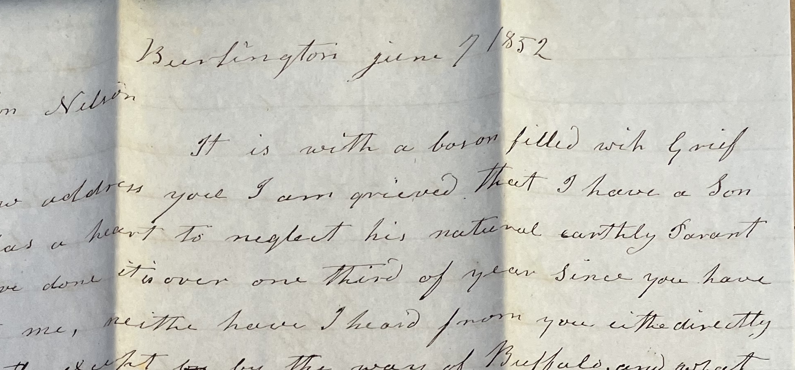

## Documenting life in nineteenth-century New England

I'm beginning the blog section of this personal website with a project that promises to keep me busy for a while. The focus is a collection of unpublished letters now in the American Antiquarian Society in Worcester (AAS) to and from members of the family of Ebenezer White (1779-1853) in the mid-nineteenth century. The letter writers include farmers, grocers, a former ferry pilot, and failed forty-niners. Although Ebenezer's eldest son Horatio Nelson White achieved some local prominence as a civic leader in the town of Panton and his younger brother Henry George White earned recognition for his  work in the stained glass industry in Buffalo, New York, the Whites were not famous or especially prosperous: much of the correspondence in fact centers on Ebenezer's constant challenges trying to scratch out a living in Vermont, and of his sons' attempts to find a better life somewhere else.

These very ordinary people are documented in a treasure of sources I could only fantasize about when I was working professionally as a scholar of the ancient Mediterranean world.  The Vermont Historical Society in Burlington holds a collection of the business papers of Ebenezer and his son Hiram. The complete inventory of Ebenezer's possesions when he died intestate was an accounting nightmare (and a source of tension in letters among Ebenezer's sons), but the archival records of the court proceedings offer us a rich trove of material. Nineteenth-century newspapers fill in and confirm details of their lives. To those existing sources, I'm contributing transcriptions of the letters, and will post notes about them here as I work through the sources. 

For starters, I've put together a [brief overview with a checklist of the letters](../../familyhistory/whiteletters/). Links in those notes lead to automatically assembled pages pulling together other documentary sources I have transcribed and indexed to individuals appearing in the White letters. If the clusters of documents sometime seems haphazard, I hope it will make more sense as the body of transcribed material grows.

