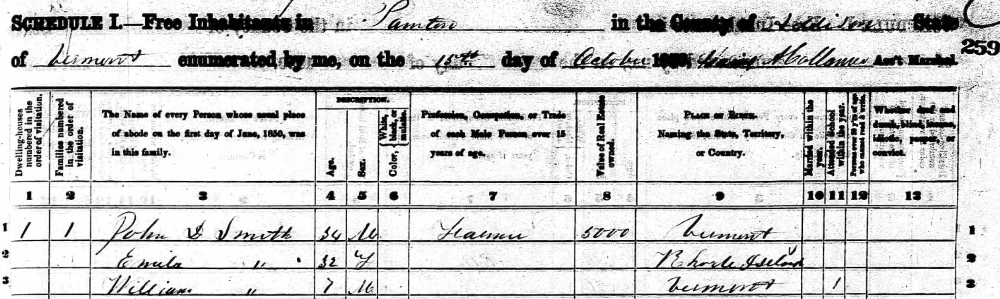
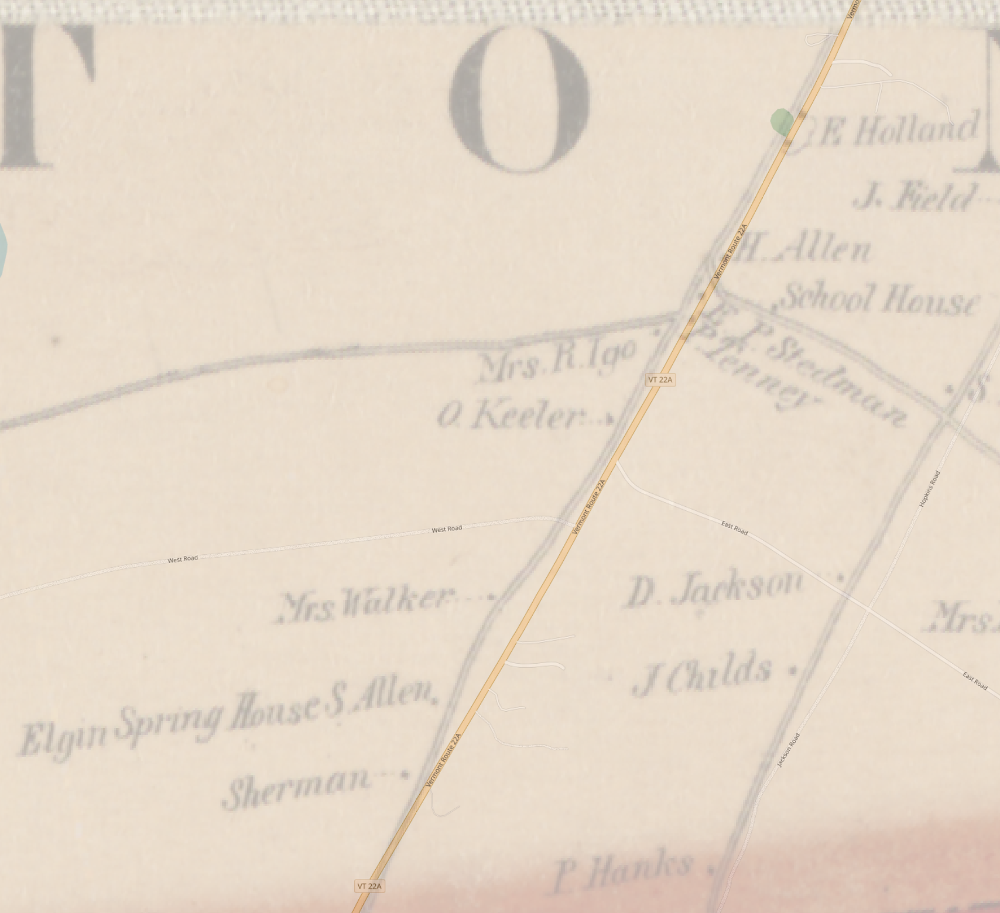
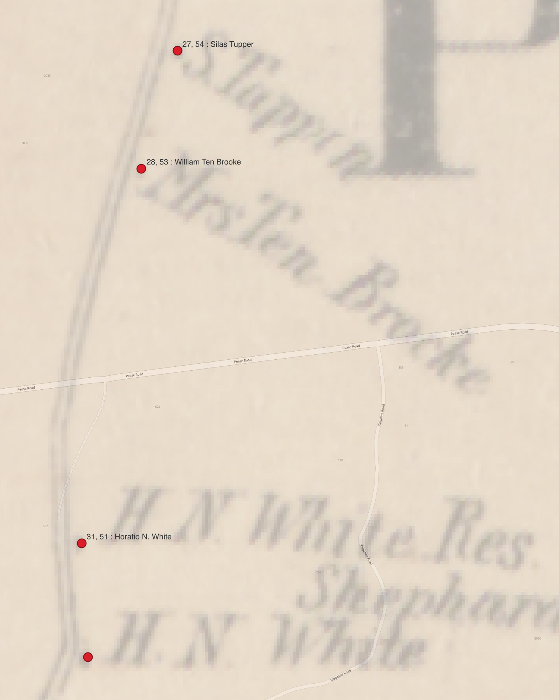
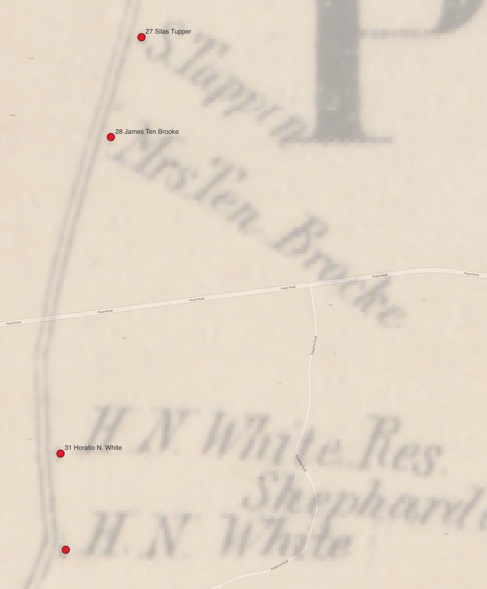
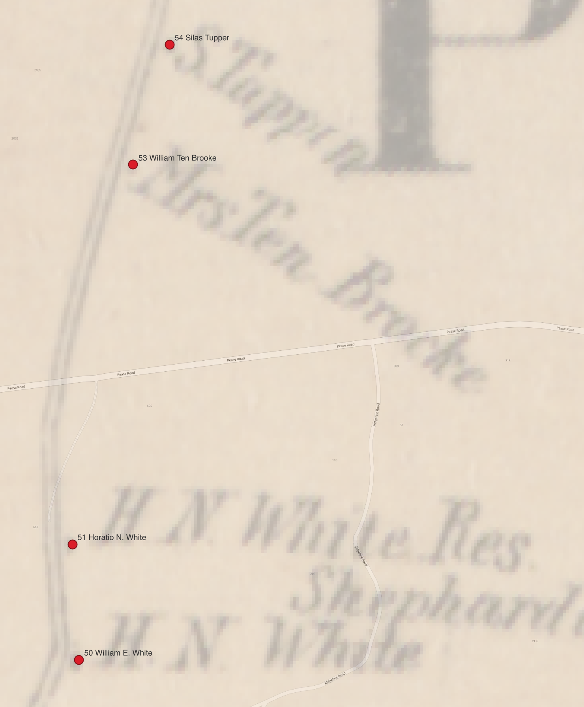
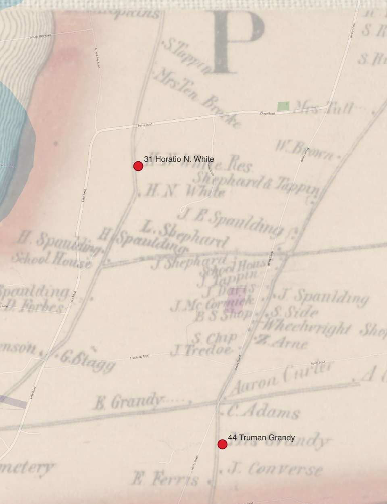

## Finding census locations on maps

On a mid-October day in 1850, Gaius A. Collum, Assistant Marshall for the U.S. Census, made his way from Panton Village towards Lake Champlain, then headed south along a series of farms bordering the lake. He numbered each residence he visited on that day from 1 to 39 as he recorded their answers to the questions for the 1850 census. Collum followed a path that would be mapped in the mid-1850s by the entrepeneurial cartographer Henry Francis Walling as part of a larger commercial project to produce detailed cadastral maps covering the entire state of Vermont.  I have been able to identify locations for about half of the houses where Collum stopped. 
 We can situate these nineteenth-century locations with some confidence thanks to publicly available data sets from the U.S. National Archives[^uscensus], and from digital archives of nineteenth-century maps.

 
 
 Walling's printed wall maps of Vermont counties were luxe products. His 1857 map of Addison County (where the census district of Panton is located) spanned more than four feet in each dimension, was printed on four sheets that were then mounted on linen backing, and cost $5 per copy, an exorbitant expense at the time. There are two printings of the map with slightly different bordering illustrations, both dated to 1857.[^walling] Both the Library of Congress and the Boston Public Library have digitized copies of the second printing.[^archives] For this post, I worked with a copy of the BPL's digitization.[^wallingmapbpl]

I georeferenced the map to create a copy I could work with in longitude-latitude coordinates. (I may add a DIY post later on how I did this, but you can download the resulting file in GeoTIFF format [here](https://dl.dropbox.com/scl/fi/4uhisdr9iwp1bg9aywfk9/commonwealth_wd376466z_image_primary_wgs84ll.tif?rlkey=iy7erqstmygtnm52kn39zr8ik&st=l169peps&dl=1) if you want to use Walling's map in a GIS now.)  Walling's map includes the surveyed boundary lines of each town in Addison county, most of which are unchanged today. Their clear corners and crossing points provide easy targets to align with modern GIS data from the state of Vermont's [Open Geodata Portal](https://geodata.vermont.gov/search?tags=isothemeboundary%2Cisothemegeodetic%2Cisothemecadastral), and are ideally spread across the area of Addison county to yield reasonable results from georeferencing. One inescapabale limit to the accuracy that can be achieved, however, are gaps between the four original printed sheets. Unfortunately the village of Panton falls right on the crossing where all four sheets touch.

Nevertheless, the resulting alignment is very usable.  In the illustration above, for example, we can see how closely a modern map of Vermont Route 22A aligns with the same road in the georeferenced version of Wallis' map. We can also see the detailed plotting with labels of every major house and structure Wallis observed. It was appealing to potential buyers to see their own house on the map -- and a gold mine for historians more than a century and a half later.  With the georeferenced map in place, I followed Gaius Collum's census listings, and matched names in the census record with labels on Walling's map.

The result was that we can now trace Collum's route on October 15, 1850, house by house. In the following illustration, points are labelled with the number Collum assigned to each house, and the name of the head of household in his census record.

:::{.column-page}

:::

## Reading the White letters: an example

Collum identified the farmer who lived at house 31 as 47-year-old Horatio N. White. In a town with a total population of 559 in the 1850 census, this is unambiguously the same Horatio Nelson White who kept a series of family letters that were passed along by five generations of his descendants until they were donated to the [American Antiquarian Society](https://www.americanantiquarian.org) (AAS) in 2024.[^aas] In fact, Horatio Nelson's family normally sent him letters addressed simply "H.N. White, Panton, Vermont," as illustrated in the detail to the right. Dated to March of 1857, it falls exactly between the time Walling completed his survey of Addison county in 1856, and the time when his map was printed in New York and Boston. 

:::{.column-margin}

: address on the cover of a letter from Henry George White, Buffalo, New York, to his brother, Horatio Nelson White in Panton, Vermont.](./address.png)
:::

### A marriage in the White family

The geographic knowledge from Wallis and the data recorded in the census illuminate the White letters in many ways. Since the White letters are dated from 1842 to 1860, the Wallis map shows us a  Panton, where Horatio Nelson lived, at exactly this time. The US Census of 1850 was the first to list individuals by name (rather than just counts of individuals in various categories), so we can follow changes in the makeup of households from decade to decade.

The marriage of Horatio Nelson's son, William, is an example. 

In 1850, for example, 

Wedding record: Ellen M. Grandey is daughter of Truman and Polly Grandey

1860 : no value for HN; WmE has 18600 which should be whole thing

| 1850 | 1860|
| --- | --- |
|  |  |

[^walling]: [This post](https://www.old-maps.com/blog/mapping-vermont-in-the-1850s/) (attribued only to "admin") from old-maps.com, provides helpful background on Walling's mapping of Vermont. A PDF on the same site has more detail including on the two printings of the Addison County map:  Dave Allen, "[Preliminary Notes on the Vermont County Maps]"(https://www.old-maps.com/vermont/00_VT_WALLMAPSoptimized.pdf), Feb. 15 2006/May 2007, https://www.old-maps.com/vermont/00_VT_WALLMAPSoptimized.pdf, accessed March 20, 2025.

[^aas]: The collection of 38 letters is available for research use in the AAS in Worcester, identified as catalog record `617483`. I'm tagging posts on this site that discuss the letters with the tag [`White letters`](https://neelsmith.quarto.pub/personal/posts.html#category=White%20letters).

[^wallingmapbpl]: Walling, Henry Francis. "Map of Addison County, Vermont." Map. Boston: Baker & Tilden, 1857. *Norman B. Leventhal Map & Education Center*, [https://collections.leventhalmap.org/search/commonwealth:wd376466z](https://collections.leventhalmap.org/search/commonwealth:wd376466z) (accessed March 20, 2025).

[^archives]: Digitizations of the second version of Walling's map of Addison county:

    - at [the Library of Congress](https://www.loc.gov/resource/g3753a.la001181a/)
    - at [the Boston Public Library](https://collections.leventhalmap.org/search/commonwealth:wd376466z)

[^uscensus]: The National Archives curates the original census sheets, and oversees a digitization program in collaboration with commercial partners. See the National Archives' guide to working with [census records online](https://www.archives.gov/research/census/online-resources). 

