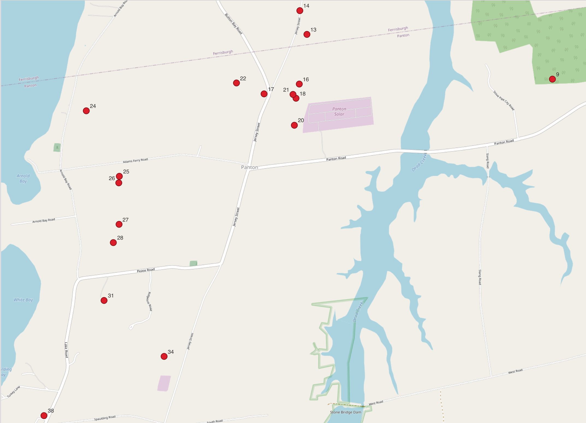
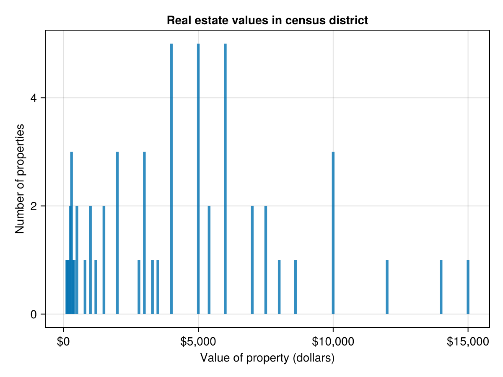
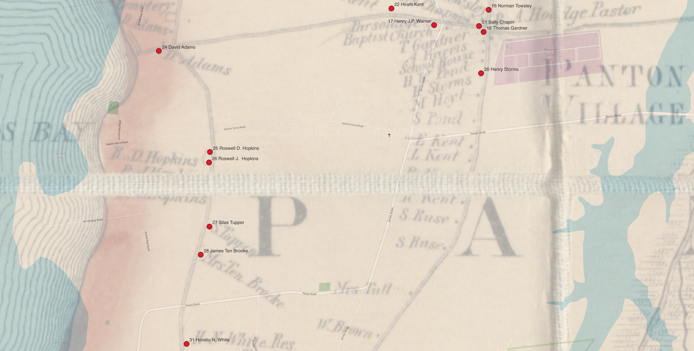
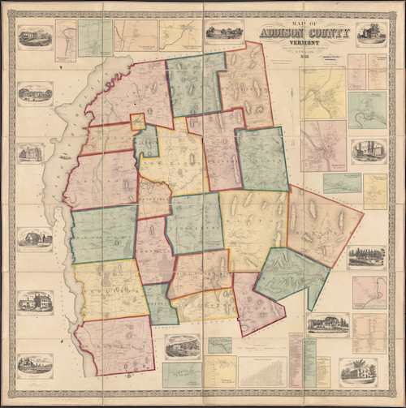

On a mid-October day in 1850, Gaius A. Collum, Assistant Marshall for the U.S. Census, made his way from Panton Village towards Lake Champlain, then headed south along a series of farms bordering the lake. He numbered each residence he visited from 1 to 39 as he recorded their answers to the questions for the 1850 census. I have been able to identify locations for about half of the houses where he stopped that day.

The property at house 31 must have been pleasant: Collum recorded its value as $7,000, a figure exceeded by only 10 of the 56 properties with recorded values in the 1850 census for Panton. Collum identified the farmer who lived at house 31 as 47-year-old Horatio N. White -- the same Horatio Nelson White who kept a series of family letters that were passed along by his descendants until they were donated to the [American Antiquarian Society](https://www.americanantiquarian.org) (AAS) in 2024.[^aas]

[^aas]: The collection of 38 letters is available for research use in the AAS in Worcester, identified as catalog record `617483`.

:::{.column-margin}

:::

Here's another note

:::{.column-margin}

: address on the cover of a letter from Henry George White, Buffalo, New York, to his brother, Horatio Nelson White in Panton, Vermont.](./address.png)
:::

Here's the result.  You can also see a major reason for imprecision in the georeferencing.

:::{.column-page}

:::

And here's

a map[^walling]. 

[^walling]: Walling, Henry Francis. "Map of Addison County, Vermont." Map. Boston: Baker & Tilden, 1857. _Norman B. Leventhal Map & Education Center_, https://collections.leventhalmap.org/search/commonwealth:wd376466z (accessed March 20, 2025).