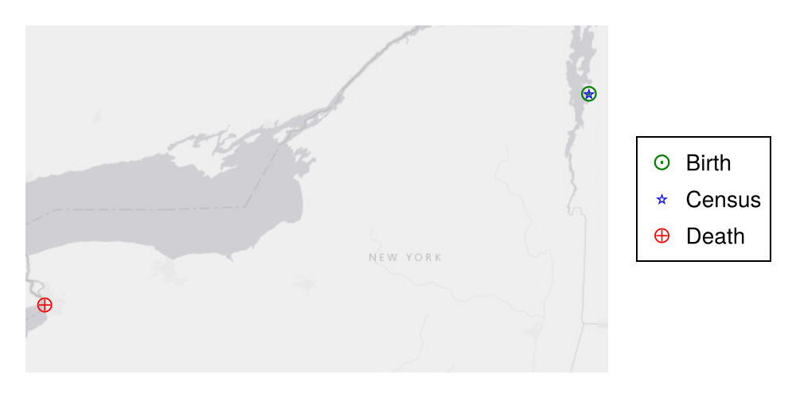

> *Page automatically generated.*

# Henry George White


## Biographical summary


*born* 1814-06-08 : *died* 1902-12-30

**Mother**: ?

**Father**: [Ebenezer White](./Ebenezer_White.html)

**Children with [Susan D. Winslow](./Susan_D._Winslow.html)**:


- [Eugene Richard White](./Eugene_Richard_White.html)

- [Eugene Richard White](./Eugene_Richard_White.html)


**Children with [Ann Quayle](./Ann_Quayle.html)**:


- [Charles H. White](./Charles_H._White.html)

- [George William White](./George_William_White.html)

- [James Herbert White](./James_Herbert_White.html)


Documented ancestors:

```{mermaid}
graph RL
%% RL ancestor diagram
Henry_George_White(<a href=''>Henry George White</a>) -->  Ebenezer_White(<a href='./Ebenezer_White.html'>Ebenezer White</a>)
Ebenezer_White(<a href=''>Ebenezer White</a>) -->  Benjamin_White(<a href='./Benjamin_White.html'>Benjamin White</a>)
class Benjamin_White father
Ebenezer_White(<a href=''>Ebenezer White</a>)  --> Ruth_Wilson(<a href='./Wilson-line/Ruth_Wilson.html'>Ruth Wilson</a>)
class Ruth_Wilson mother
class Ebenezer_White father
classDef mother fill:#ffd1dc
classDef father fill:#daf0f7  
classDef marriage fill:#ffffff

```


Documented descendants:

```{mermaid}
graph LR
%% LR descendant diagram
class Henry_George_White_and_Susan_D._Winslow marriage
Henry_George_White(<a href=''>Henry George White</a>) --> Henry_George_White_and_Susan_D._Winslow{{ }}
Susan_D._Winslow(<a href='./Susan_D._Winslow.html'>Susan D. Winslow</a>) --> Henry_George_White_and_Susan_D._Winslow{{ }}
class Henry_George_White father
class Susan_D._Winslow mother
Henry_George_White_and_Susan_D._Winslow{{ }} --> Eugene_Richard_White(<a href='./Eugene_Richard_White.html'>Eugene Richard White</a>)
class Henry_George_White father
class Susan_D._Winslow mother
Henry_George_White_and_Susan_D._Winslow{{ }} --> Eugene_Richard_White(<a href='./Eugene_Richard_White.html'>Eugene Richard White</a>)
class Henry_George_White_and_Ann_Quayle marriage
Henry_George_White(<a href=''>Henry George White</a>) --> Henry_George_White_and_Ann_Quayle{{ }}
Ann_Quayle(<a href='./Ann_Quayle.html'>Ann Quayle</a>) --> Henry_George_White_and_Ann_Quayle{{ }}
class Henry_George_White father
class Ann_Quayle mother
Henry_George_White_and_Ann_Quayle{{ }} --> Charles_H._White(<a href='./Charles_H._White.html'>Charles H. White</a>)
class Henry_George_White father
class Ann_Quayle mother
Henry_George_White_and_Ann_Quayle{{ }} --> George_William_White(<a href='./George_William_White.html'>George William White</a>)
class Henry_George_White father
class Ann_Quayle mother
Henry_George_White_and_Ann_Quayle{{ }} --> James_Herbert_White(<a href='./James_Herbert_White.html'>James Herbert White</a>)
classDef mother fill:#ffd1dc
classDef father fill:#daf0f7  
classDef marriage fill:#ffffff

```


## Dated events


- 1814-06-08 Birth of Henry George White
- 1902-12-30 Death of Henry George White





## Sources for preceding conclusions
Sources for birth:


| Date | Source | Place | Type |
| --- | --- | --- | --- |
| 1814-06-08 | [[Burlington, Vermont]] | [H.G. White obituary in Buffalo News p. 5](./../../../transcriptions/newspapers/H.G._White_obituary_in_Buffalo_News_p._5.html) | direct |

Sources for death:


| Date | Source | Type |
| --- | --- | --- |
| 1902-12-30 | [H.G. White obituary in Buffalo News p. 5](./../../../transcriptions/newspapers/H.G._White_obituary_in_Buffalo_News_p._5.html) | direct |

Sources for parents:


| Father | Mother | Source | Type |
| --- | --- | --- | --- |
| [Ebenezer White](./Ebenezer_White.html) | [](Henry George White) | [Ebenezer White probate - sales paper](./../../../transcriptions/probate/Ebenezer_White_probate/Ebenezer_White_probate_-_sales_paper.html) | indirect |

Sources for children with [Susan D. Winslow](./Susan_D._Winslow.html)


- [H.G. White obituary in Buffalo News p. 5](./../../../transcriptions/newspapers/H.G._White_obituary_in_Buffalo_News_p._5.html)

- [Eugene White in North Presbyterian, Amherst, NY](./../../../transcriptions/church-registries/Eugene_White_in_North_Presbyterian,_Amherst,_NY.html)


Sources for children with [Ann Quayle](./Ann_Quayle.html)


- [H.G. White obituary in Buffalo News p. 5](./../../../transcriptions/newspapers/H.G._White_obituary_in_Buffalo_News_p._5.html)

- [H.G. White obituary in Buffalo News p. 5](./../../../transcriptions/newspapers/H.G._White_obituary_in_Buffalo_News_p._5.html)

- [H.G. White obituary in Buffalo News p. 5](./../../../transcriptions/newspapers/H.G._White_obituary_in_Buffalo_News_p._5.html)


## All sources for Henry George White


- [Henry George White 1840 census](./../../../transcriptions/census/Panton_Vermont_census/Henry_George_White_1840_census.html)
- [Henry George White 1850 census](./../../../transcriptions/census/Panton_Vermont_census/Henry_George_White_1850_census.html)
- [Eugene White in North Presbyterian, Amherst, NY](./../../../transcriptions/church-registries/Eugene_White_in_North_Presbyterian,_Amherst,_NY.html)
- [Artemas White freedmans bank record 2894](./../../../transcriptions/freedmans-bank-records/Artemas_White_freedmans_bank_record_2894.html)
- [1855-04-01   to HN](./../../../transcriptions/letters/1855-04-01___to_HN.html)
- [1842-07-17-EW-HNW](./../../../transcriptions/letters/White_letters/1842-07-17-EW-HNW.html)
- [1842-09-31-AW-HNW](./../../../transcriptions/letters/White_letters/1842-09-31-AW-HNW.html)
- [1848-07-02-HGW-to-HNW](./../../../transcriptions/letters/White_letters/1848-07-02-HGW-to-HNW.html)
- [1849-08-09-EW-toHNW](./../../../transcriptions/letters/White_letters/1849-08-09-EW-toHNW.html)
- [1849-09-09-EW-to-HNW](./../../../transcriptions/letters/White_letters/1849-09-09-EW-to-HNW.html)
- [1851-03-02-EW-to-HNW](./../../../transcriptions/letters/White_letters/1851-03-02-EW-to-HNW.html)
- [1851-07-27-EW-to-HNW](./../../../transcriptions/letters/White_letters/1851-07-27-EW-to-HNW.html)
- [1851-09-03-HGW-to-HNW](./../../../transcriptions/letters/White_letters/1851-09-03-HGW-to-HNW.html)
- [1851-10-26-HGW-to-HNW](./../../../transcriptions/letters/White_letters/1851-10-26-HGW-to-HNW.html)
- [1851-10-30-EW-to-HNW](./../../../transcriptions/letters/White_letters/1851-10-30-EW-to-HNW.html)
- [1851-12-25-EW-to-HNW](./../../../transcriptions/letters/White_letters/1851-12-25-EW-to-HNW.html)
- [1852-02-16-HGW-to-HNW](./../../../transcriptions/letters/White_letters/1852-02-16-HGW-to-HNW.html)
- [1852-08-01-HGW-to-HNW](./../../../transcriptions/letters/White_letters/1852-08-01-HGW-to-HNW.html)
- [1852-11-11-EW-to-HNW](./../../../transcriptions/letters/White_letters/1852-11-11-EW-to-HNW.html)
- [1852-12-19-HGW-to-FAW](./../../../transcriptions/letters/White_letters/1852-12-19-HGW-to-FAW.html)
- [1854-03-12-HGW-to-HNW](./../../../transcriptions/letters/White_letters/1854-03-12-HGW-to-HNW.html)
- [1855-04-01-HGW-to-HNW](./../../../transcriptions/letters/White_letters/1855-04-01-HGW-to-HNW.html)
- [1855-08-19-HGW-to-HNW](./../../../transcriptions/letters/White_letters/1855-08-19-HGW-to-HNW.html)
- [1856-01-02 HG to HN](./../../../transcriptions/letters/White_letters/1856-01-02_HG_to_HN.html)
- [H.G. White obituary in Buffalo Enquirer](./../../../transcriptions/newspapers/H.G._White_obituary_in_Buffalo_Enquirer.html)
- [H.G. White obituary in Buffalo News p. 5](./../../../transcriptions/newspapers/H.G._White_obituary_in_Buffalo_News_p._5.html)
- [H.G. White obituary in Buffalo News](./../../../transcriptions/newspapers/H.G._White_obituary_in_Buffalo_News.html)
- [Ebenezer White probate - sales paper](./../../../transcriptions/probate/Ebenezer_White_probate/Ebenezer_White_probate_-_sales_paper.html)
- [Ebenezer White warrant of division](./../../../transcriptions/probate/Ebenezer_White_probate/Ebenezer_White_warrant_of_division.html)
- [Susan Prince tombstone](./../../../transcriptions/tombstones/Susan_Prince_tombstone.html)
